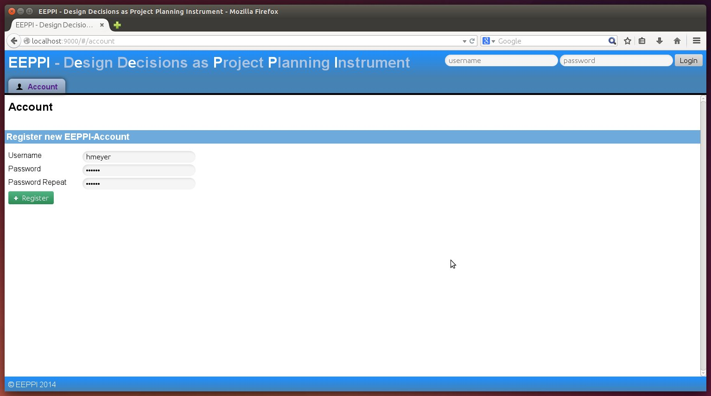
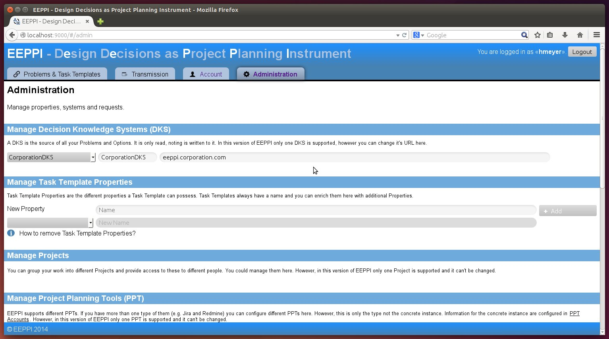
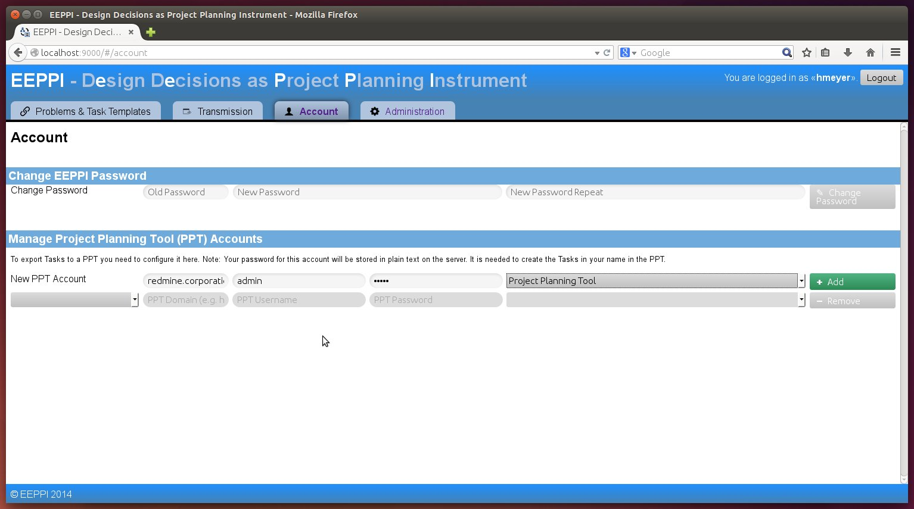

EEPPI Totorial
==============

Installation
------------

* Environment: Ubuntu Server 14.04 32 Bit
* Lates Build of EEPPI: Snapshot-0.5.zip

1. Install unzip
        sudo apt-get install default-jre unzip

2. Install java 8
        sudo add-apt-repository -y ppa:webupd8team/java
        sudo apt-get update
        echo oracle-java8-installer shared/accepted-oracle-license-v1-1 select true | sudo /usr/bin/debconf-set-selections
        sudo apt-get -y install oracle-java8-installer`

3. Install EEPPI
    1. Unpack SNAPSHOT-0.5.zip
            unzip SNAPSHOT-0.5.zip -d /home/{yourUserName}/eeppi_zip/

    2. Start EEPPI
            sudo /home/vagrant/eeppi/bin/eeppi -Dhttp.port=9990 -DapplyDownEvolutions.default=true -DapplyEvolutions.default=true &

    3. Create crontab to start EEPPI after reboot
            ( crontab -l 2>/dev/null | grep -Fv ntpdate ; printf -- "@reboot sudo /home/vagrant/eeppi/bin/eeppi -Dhttp.port=9990 -DapplyDownEvolutions.default=true -DapplyEvolutions.default=true &\n" ) | crontab
    4. EEPPI ist available at host:9000

Configure Play
--------------

* Change Port:

Configure EEPPI
---------------

1. Start EEPPI using host:port
    

2. Create a new user
    1. Navigate to "Account"
    2. Enter username & password and click "Register"
        
    3. Login with the new created user
        
2. Define your Decision Knowledge System
    1. Navigate to "Administration" > "DKS"
    2. Enter the address of your DKS, changes will be safed on clicking outside field
        
3. Create an account for your Project Planning tool
    1. Navigate to "Account" > "Project Planning Tool Accounts"
    2. Create a new account entering the url, project planning tool, path, user & password
        
4. Create a template to transmit tasks to your project planning tool
    1. Navigate to "Administration" > "Request Templates"
    2. Create a new template entering api path & request body
        1. Take a look inside the documentation of the api of your project planning tool
        2. Create a request to create an issue in your project planning tool. E.g. for Redmine:
                {
                    "issue"; {
                        "project_id": "test",
                        "tracker_id": 1,
                        "parent_issue_id": "0",
                        "subject": "A new task",
                        "assigned_to_id": 1
                    }
                }

            

        3. Replace values by variables:
                {
                    "issue"; {
                        "project_id": "${pptProject}",
                        "tracker_id": ${taskTemplate.type},
                        "parent_issue_id": "${parentRequestData.issue.id}",
                        "subject": "${taskTemplate.name}",
                        "assigned_to_id": ${taskTemplate.attributes.Assignee}
                    }
                }

        4. Write processors you need. Processors are javascript functions transforming values. E.g. tracker-transformation-processor:
            1. Navigate to "Administration" > "Processors"
            2. create the new Processor 'trackerTransformation':
                    function(typeValue) {
                        if(typeValue == 'Feature') {
                            return 1;
                        } else if(typeValue == 'Bug') {
                            return 2;
                        } else {
                            return 0;
                        }
                    }

            5. Use the processor transforming types to tracker ids:
                *
                        "tracker_id": $trackerTransformation:(taskTemplate.type)$,
                * Path values like 'taskTemplate.type' will be injected with object values:
                    * 'taskTemplate': current task template object
                    * 'node': current node from dks system
                    * 'pptProject': project identifier from transformation wizard
                    * 'parentRequestData': only set if there was a parent request. Contains data returned from your ppt.
                * Text values like '"Text value"' will be handled and text.
                * You can use variables to create path or text values, e.g.
                        $someProcessor.(${taskTemplate.attributes.nodeSpecialValuePath}, "This will be assigned to ${taskTemplate.attributes.Assignee}")$

                * Escape commas inside processor arguments. Otherwise the will be interpreted as argument divider:
                        $otherProcessor.("This will be assigned to ${taskTemplate.attributes.Assignee}\, ${taskTemplate.attributes.Stakeholder}")$

                * There are two types of processors and variables:
                    * '${..} variables and $..:(..) processors': Will be executed before transmitting the request, you can not use 'parentRequestData' because it's not yet set
                    * '$!{..} variables and $!..:(..) processors': Will be executed on transmitting the request, you can only use 'parentRequestData' to access the return values of the last parent request.
            6. Use processors to generate JSON code:
                    $!ifElse:(parentRequestData.issue.id,""parent_issue_id": "$!{parentRequestData.issue.id}"\,", "")$
            7. Use redefined processors:
                        $mapExistingAssignees:(taskTemplate.attributes.Assignee, "Project Planner:1\,Customer:1\,Architect:1",""assigned_to_id": ${taskTemplate.attributes.Assignee}\,")$
                        $replaceTaskTemplateValueByPPTValue:(taskTemplate.attributes.Type, "Bug:1\,Feature:2\,Support:3",""tracker_id": ${taskTemplate.attributes.Type}\,")$

            8. Complete your request template transforming all needed values. E.g.
                    {
                        "issue"; {
                            "project_id": "${pptProject}",
                            "tracker_id": $trackerTransformation:(taskTemplate.type)$,
                            $!ifElse:(parentRequestData.issue.id,""parent_issue_id": "$!{parentRequestData.issue.id}"\,", "")$
                            "subject": "${taskTemplate.name}",
                            $mapExistingAssignees:(taskTemplate.attributes.Assignee, "Project Planner:1\,Customer:1\,Architect:1",""assigned_to_id": ${taskTemplate.attributes.Assignee}\,")$
                        }
                    }
                    
                
