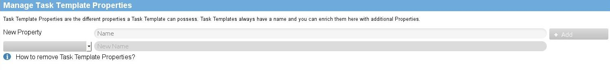

EEPPI Tutorial
==============

Installation
------------

**If you would like to install and run EEPPI using a script, have a look to the setup script of the vagrant box (/home/tobias/Business/studium/modules/BA/HSR.BA.Project/project/vagrant/setup.sh).**

To install EEPPI by hand, do the following steps. You can use the declared comands if you are using an Ubuntu:

* Environment: Ubuntu Server 14.04 32 Bit
* Lates Build of EEPPI: EEPPI-1.0.zip

1. Install unzip
        apt-get -y install unzip

2. Install java 8
        sudo add-apt-repository -y ppa:webupd8team/java
        sudo apt-get update
        echo oracle-java8-installer shared/accepted-oracle-license-v1-1 select true | sudo /usr/bin/debconf-set-selections
        sudo apt-get -y install oracle-java8-installer`

3. Install EEPPI
    1. Unpack EEPPI-1.0.zip
            sudo unzip EEPPI-1.0.zip -d /usr/local/bin/eeppi_zip/
            sudo mv /usr/local/bin/eeppi_zip/`ls -1 /usr/local/bin/eeppi_zip/ | tail -n 1` /usr/local/bin/eeppi/
            sudo rmdir /usr/local/bin/eeppi_zip

    2. Start EEPPI
            sudo /usr/local/bin/eeppi/bin/eeppi -Dhttp.port=80 -DapplyDownEvolutions.default=false -DapplyEvolutions.default=true &

    3. Create crontab to start EEPPI after reboot
            ( crontab -l 2>/dev/null | grep -Fv ntpdate ; printf -- "@reboot sudo /usr/local/bin/eeppi/bin/eeppi -Dhttp.port=80 -DapplyDownEvolutions.default=true -DapplyEvolutions.default=true &\n" ) | crontab
    4. EEPPI ist available at HOST:80

Configure Play
--------------

See [Play documentation: Productive configuration](https://www.playframework.com/documentation/2.3.x/ProductionConfiguration) for advanced configuration.

* Change Database to postgresql database 'eeppi' running on localhost:
    1. create an application.conf in your prefered configuration directory containing the following lines:
            db.default.driver=org.postgresql.Driver
            db.default.url="postgres://localhost/eeppi"
            db.default.user="eeppiUser"
            db.default.password="***************"
    2. Run eeppi, specify alternative configuration file:
            sudo /usr/local/bin/eeppi/bin/eeppi -Dhttp.port=80 -DapplyDownEvolutions.default=false -DapplyEvolutions.default=true -Dconfig.resource=/path/to/alternative/application.conf &

Configure EEPPI
---------------

1. Start EEPPI using HOST:80

    

2. Create a new user account
    1. Navigate to "Account"
    2. Enter username & password and "Register" the new user.

        

    3. Login with the just created user account

        

2. Define your Decision Knowledge System (e.g. your ADRepo)
    1. Navigate to "Administration" > "Decision Knowledge Systems"
    2. Enter the address of your DKS, changes will be applied on clicking outside field

        

    3. Navigate to "Problems & Task Templates" and check if the items from your DKS will load to verify your configuration.

        

3. Create an account for your Project Planning tool
    1. Navigate to "Account" > "Project Planning Tool Accounts"
    2. Create a new account entering the url, project planning tool, path, user & password

        

4. Create a template to transmit tasks to your project planning tool
    1. Navigate to "Administration" > "Request Templates"
    2. Create a new template entering api path & request body
        1. Take a look inside the documentation of the api of your project planning tool. E.g. [Redmine API: Creating an issue](http://www.redmine.org/projects/redmine/wiki/Rest_Issues#Creating-an-issue).
        2. Create a request to create an issue in your project planning tool. E.g. for Redmine:
                {
                    "issue"; {
                        "project_id": "test",
                        "tracker_id": 1,
                        "parent_issue_id": "0",
                        "subject": "A new task",
                        "assigned_to_id": 1
                    }
                }

            

        3. Replace values by variables:
                {
                    "issue"; {
                        "project_id": "${pptProject}",
                        "tracker_id": ${taskTemplate.type},
                        "parent_issue_id": "${parentRequestData.issue.id}",
                        "subject": "${taskTemplate.name}",
                        "assigned_to_id": ${taskTemplate.attributes.Assignee}
                    }
                }

        4. Write processors you need. Processors are javascript functions transforming values. E.g. tracker-transformation-processor:
            1. Navigate to "Administration" > "Processors"
            2. create the new Processor 'trackerTransformation':
                    function(typeValue) {
                        if(typeValue == 'Feature') {
                            return 1;
                        } else if(typeValue == 'Bug') {
                            return 2;
                        } else {
                            return 0;
                        }
                    }

            5. Use the processor transforming types to tracker ids:
                *
                        "tracker_id": $trackerTransformation:(taskTemplate.type)$,
                * Path values like 'taskTemplate.type' will be injected with object values:
                    * 'taskTemplate': current task template object
                    * 'node': current node from dks system
                    * 'pptProject': project identifier from transformation wizard
                    * 'parentRequestData': only set if there was a parent request. Contains data returned from your ppt.
                * Text values like '"Text value"' will be handled and text.
                * You can use variables to create path or text values, e.g.
                        $someProcessor.(${taskTemplate.attributes.nodeSpecialValuePath}, "This will be assigned to ${taskTemplate.attributes.Assignee}")$

                * Escape commas inside processor arguments. Otherwise the will be interpreted as argument divider:
                        $otherProcessor.("This will be assigned to ${taskTemplate.attributes.Assignee}\, ${taskTemplate.attributes.Stakeholder}")$

                * There are two types of processors and variables:
                    * '${..} variables and $..:(..) processors': Will be executed before transmitting the request, you can not use 'parentRequestData' because it's not yet set
                    * '$!{..} variables and $!..:(..) processors': Will be executed on transmitting the request, you can only use 'parentRequestData' to access the return values of the last parent request.
            6. Use processors to generate JSON code:
                    $!ifElse:(parentRequestData.issue.id,""parent_issue_id": "$!{parentRequestData.issue.id}"\,", "")$
            7. Use predefined processors like 'mapExistingAssignees':
                        $mapExistingAssignees:(taskTemplate.attributes.Assignee, "Project Planner:1\,Customer:1\,Architect:1",""assigned_to_id": ${taskTemplate.attributes.Assignee}\,")$
                        $replaceTaskTemplateValueByPPTValue:(taskTemplate.attributes.Type, "Bug:1\,Feature:2\,Support:3",""tracker_id": ${taskTemplate.attributes.Type}\,")$

            8. Complete your request template transforming all needed values. E.g.
                    {
                        "issue"; {
                            "project_id": "${pptProject}",
                            "tracker_id": $trackerTransformation:(taskTemplate.type)$,
                            $!ifElse:(parentRequestData.issue.id,""parent_issue_id": "$!{parentRequestData.issue.id}"\,", "")$
                            "subject": "${taskTemplate.name}",
                            $mapExistingAssignees:(taskTemplate.attributes.Assignee, "Project Planner:1\,Customer:1\,Architect:1",""assigned_to_id": ${taskTemplate.attributes.Assignee}\,")$
                        }
                    }

                

5. Create task template properties
    1. Navigate to "Administration" > "Manage Task Template Properties"

        

    2. Add the new properties you need, e.g. "Stakeholder"
    3. Modify existing properties. You can't remove properties but you can rename them

6. Create task templates
    1. Navigate to "Problems & Task Templates" > "Task Templates"

    

    2. Add new Task Templates
        1. Navigate to "Create new Task Template"
        2. Enter the name of the new template, e.g. "Install debug tools", save it.
        3. Change the properties and property values below
    3. Map task templates with problems
        1. Select the problem or alternative on the left
        2. "Map" the task template on the right

        

7. Transfer tasks to a project planning tool
    1. Navigate to "Transmission"
    2. Choose the target system (your redmine or your jira the tasks should be exported to)

    

    3. Choose the request template to transmit the tasks. Please ensure you choose the correct request template matching your target system. If your target system is Redmine, be sure your are using a redmine request template.
    4. Fill in the identifiyer of the project in your projectplanning tool. This depends how you mapped this value in the request template.
    5. Choose the tasks you would like to export.

    

    6. Set the parent of subtasks or tasks of an option of a decisions. You can't create hierarchies with more than one sublayer because some project planning system does not support this.
    7. Transform the tasks and check the generated syntax of the request at minimun before the first export. The syntax should be a correct json containing all your values and there may be some secondary variables and processors (starting with '$!') if you used some. This placeholders will be replaced on transmitting the template.

    

    8. If the syntax is correct and your project planning tool running, start the transmission.
    After the transmit, you can see what data your project planning tool returned and use this data for more advanced secondary processors in your request template, e.g. to map tasks with parent tasks.
    If the transmit failed, the response can help you to determine the problem.
    Most problems can occour:
        * JSON syntax incorrect
        * JSON is not matching the API of your project planning tool correct (maybe incorrect field names or values)
        * Project planning tool is not running

8. Login to your project planning tool and check the created tasks.
